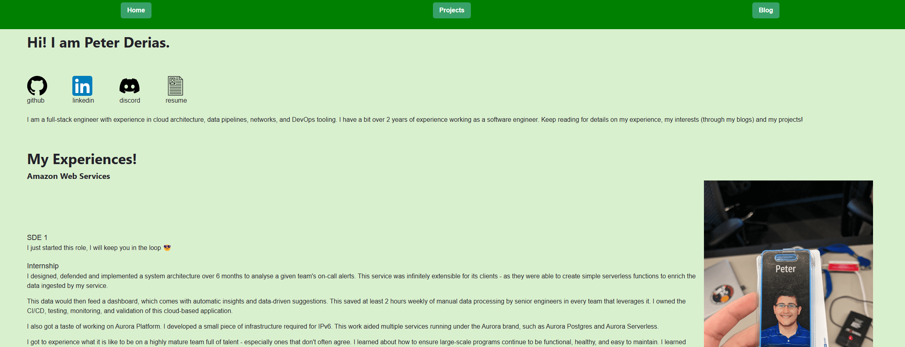
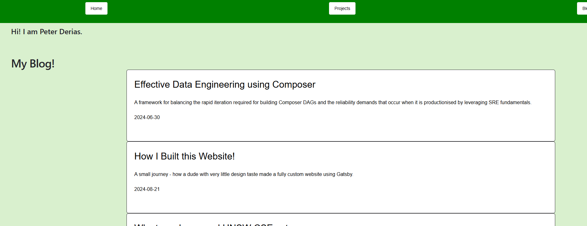
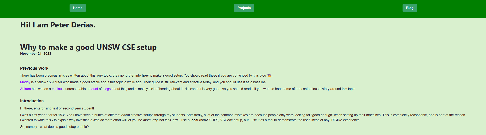

## Peter's Personal website!

This website is deployed on https://peedee2002.github.io. Have a look!

This website is built in Nextjs, and deployed on github pages (to save my wallet).

I built this website to be as easy as possible to edit, when it comes to its content. So, I have made it with MDX files as the means of generating content. This allows me to add new experiences, blogs, and projects only by creating markdown files. The routing and listing of these shown below is handled auto-magically without me having to edit any code files.

This helps me write more, and so change my focus on either coding or writing when developing the website - not both.

This website used to be built in gatsby too! There is a story to be written about that, which I will add to my blog one day.
