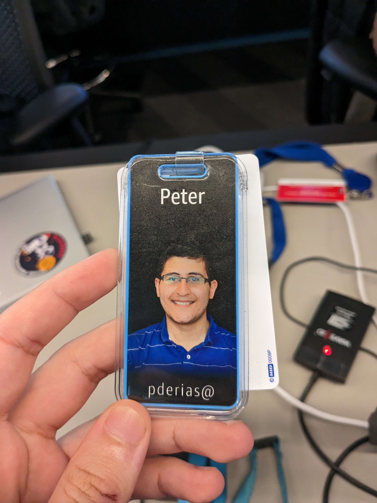

<table>
<tr>
<td>

I designed, defended and implemented a system architecture over 6 months to analyse a given team's on-call alerts. This service was
infinitely extensible for its clients - as they were able to create simple serverless functions to enrich the data injested by my service.

This data would then feed a dashboard, which comes with automatic insights and data-driven suggestions. This saved at least 2 hours weekly
of manual data processing by senior engineers in every team that onboards onto it. I owned the CI/CD, testing, monitoring, and validation
of this cloud-based application.

I also got a taste of working on Aurora Platform. I developed a small piece of infrastructure required for IPv6. This work aided
multiple services running under the Aurora brand, such as Aurora Postgres and Aurora Serverless.

I got to experience what it is like to be on a highly mature team full of talent - albiet often competing talent. I learned about how to
ensure large-scale programs continue to be functional, healthy, and easy to maintain. I learned these best practices and am delighted to carry
them forward throughout my career.

</td>
<td>

</td>
</tr>
</table>
