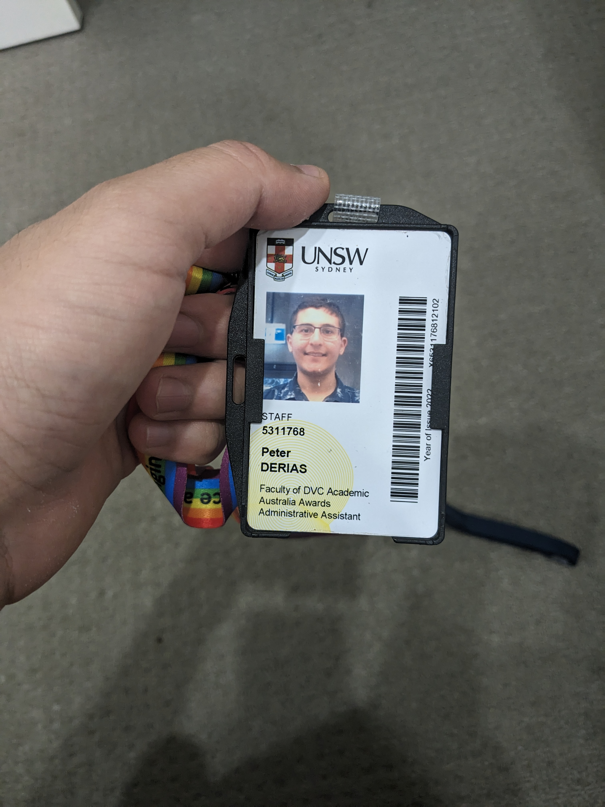

In CSE, I led classes of 25 students twice a week. I guided students through COMP1531. This is a group-work course, targeting skills such as
communication and familiarity with software engineering tools such as git and JavaScript. Ran 1 hour tutoring sessions to cover core concepts
and answer questions on software engineering development.

I also had the privilege to write course exams sat by 700 students, and managed student queries regarding it over a 24 hour exam block.

I also taught COMP6991, a course covering Rust and language design generally.

This experience was by far the most impactful on me. It taught me how to interact with large groups of different people, manage conflict, foster
cohesion, and express complex requirements that are suited to the experience of different students.

