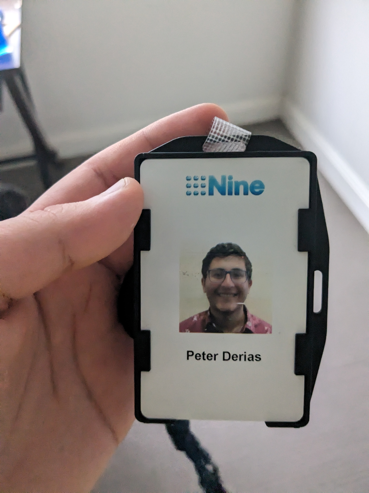

### Gradate Engineer

When I came back after my graduation, Nine's data team had expanded the small ambitions for local development into a new code-first approach. This involved some of my old work in local development, as well as a larger
ambition to incorporate techniques like containerisation and IaC to create further isolation and better cloud management. I worked on documenting and provisioning project sets for
teams to have their own isolated environments. This would further improve the agility of teams as they no longer need to share cloud resources (their locks, dependencies or repostories).

This also segnificantly reduced complexity for any given data engineer. I worked on providing CI/CD tooling templates that can be quickly spun up by client teams, and worked on scalability concerns
for my own team. I leveraged paralellism to reduce this concern and migrated our products to be runnable in the base environment - making sure teams can spin it up easily using their own resources.

In the case of shared resources like BigQuery compute slots, I aided in ensuring hygenic use by users - building a monitoring service which ensures no user is using too many resources.

Overall, I worked in the DevOps space to level up team agility. I worked directly with teams to learn and implement exactly what features they would need from Google cloud platform - and more importantly what was slowing them down. We made elegant abstractions to give them all the configuration they need, and nothing more.

### Internship

I helped in the collection and analysis of data from applications ranging from the SMH, the Age, and 9Now. user events such as page views,
user stories and page events were triggered in a systematic way from various differing applications and tech stacks.

I also started and handed off a project over 1 month to re-architect a data team's infrastructure in GCP by leveraging Composer and
Docker, to support local development and to deliver cost savings and reliability improvements. This led to dramatic speedups in our
development iteration cycles, which would take at least 5 minutes previously to run the most basic tests. These iteration cycles would have to be made to make any code changes.
They were now a minute at most, and are isolated from the changes being made by other engineers in the same environment - providing more stability to shared development resources.

Most importantly, I got to meet some incredible engineers who were driven by both innovation and product improvement. I was inspired by the
work done at nine to balance the needs of the business to the needs of the engineers. I saw how to effectively communicate with people from
diverse fields.

