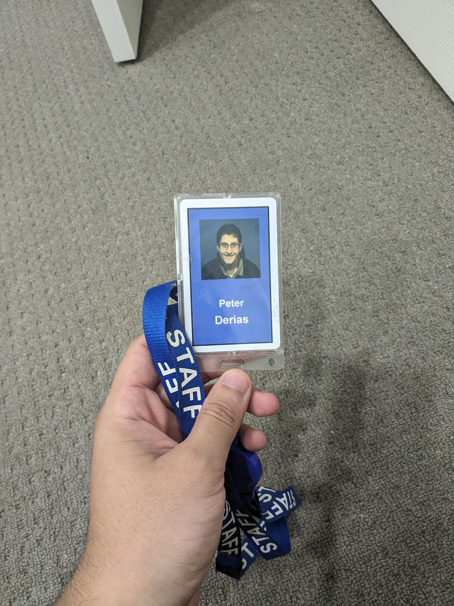

<table>
<tr>
<td>
I developed product features using a Java micro-service back-end and Angular.js front-end with review and testing. I also developed an
internal tool written in React and Express for observing environment health and status.

I saved hours of manual testing time, and saved hours of outage diagnosis time during incidents involving the team. I
also managed back-end, front-end, and deployment of this full stack application to AWS. I also refactored large Java projects for more
efficient deployments to better leverage serverless tools on AWS.

</td>
<td>

</td>
</tr>
